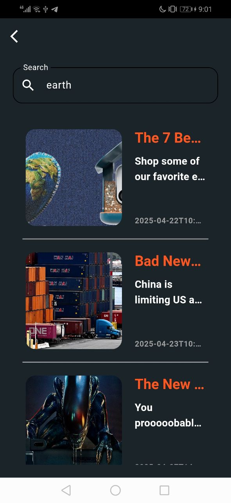

# News Hub 📰

A Flutter news application that provides real-time updates across multiple categories, featuring a clean interface and seamless user experience.

## Features
- **Multiple News Categories**: Access Business, Sports, and Science news
- **Dark/Light Theme**: Toggle between dark and light modes
- **Real-Time Search**: Search functionality to find specific news articles
- **Dynamic UI**: Responsive design that adapts to different screen sizes
- **Image Caching**: Efficient loading and caching of news images

## Technologies Used
- **Framework:** Flutter
- **State Management:** BLoC Pattern
- **API Integration:** Dio
- **Image Handling:** Cached Network Image
- **Theme Management:** Custom theme implementation

## API Integration
The app uses the News API to fetch real-time news data across different categories.

## Screenshots (Dark Mode)

### Business News

### Sports News

### Science News

### Search Screen

### Light Mode

### Business News

### Sports News

### Science News

### Search Screen

